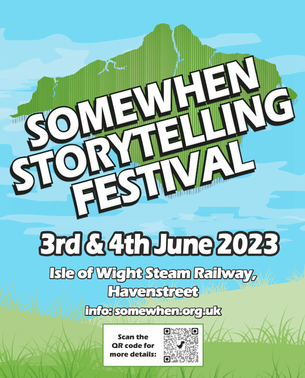

- *Location*: Isle of Wight Steam Railway, Havenstreet, Isle of Wight, UK
- *Date:* 6-7th June 2023 
- *Time:* 10:00am - late

__[BUY TICKETS HERE](https://www.ticketsource.co.uk/somewhen-storytelling-festival)__

The *Somewhen Storytelling Festival* is a two day, non-camping storytelling festival running several stages at the Havenstreet Steam Railway, Isle of Wight, on the first weekend in June, 2023.

Stages include:

- Event Barn (main stage)
- Library stage
- Woodland Stage
- *Train Story — popup stage featuring quick tales from local Island storytellers (free to all IW Steam railway visitors; no additional festival ticket required)*

The festival will include headline storytelling performances, puppetry, local storytellers, a wide range of local speakers, live music, and "open mic" storytelling circles.

The full festival program will be made available in due course.

*Somewhen Festival is the first in a planned year long series of storytelling events on the Isle of Wight organised by the Island Storytellers.*

 
