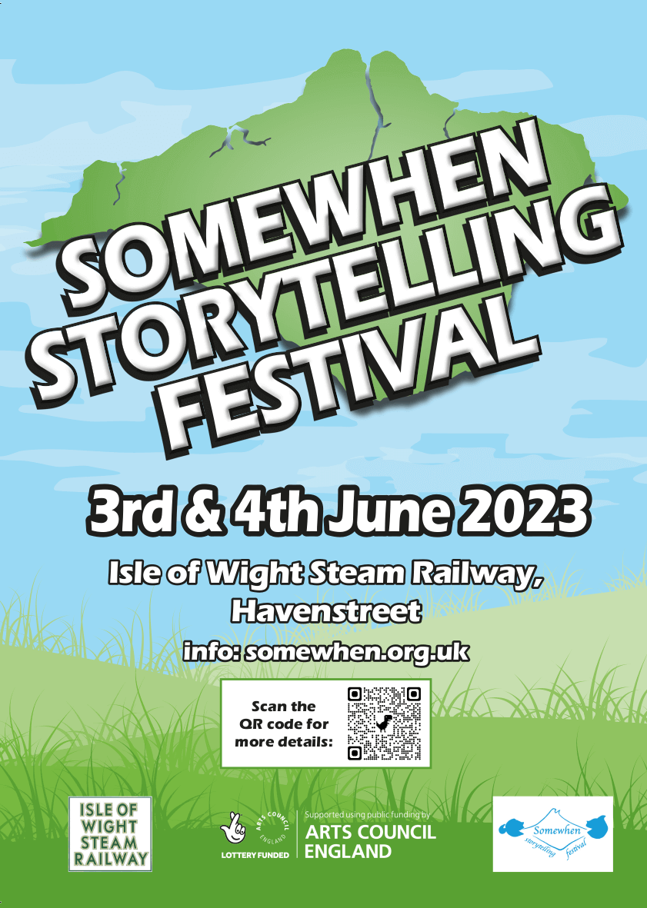
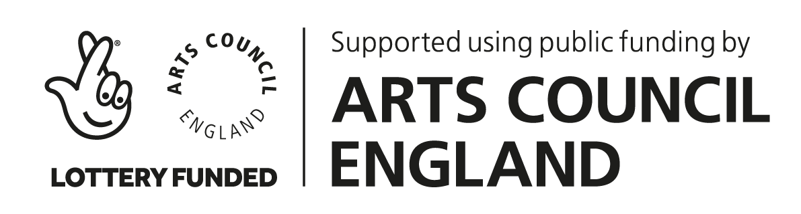
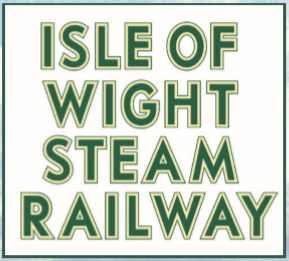

    

- *Location*: [Isle of Wight Steam Railway](https://iwsteamrailway.co.uk/), Havenstreet, Isle of Wight, UK
- *Date:* 3rd-4th June 2023 
- *Time:* 10:00am - late

    <a class="sw-ticket-link" href="https://www.ticketsource.co.uk/somewhen-storytelling-festival">BUY TICKETS HERE</a>
    <a class="sw-ticket-link" href="https://www.ticketsource.co.uk/somewhen-storytelling-festival">BUY TICKETS HERE</a>
    <a class="sw-ticket-link" href="https://www.ticketsource.co.uk/somewhen-storytelling-festival">BUY TICKETS HERE</a>

The <strong>Somewhen Storytelling Festival</strong> is a two day, non-camping storytelling festival running several stages at the Havenstreet Steam Railway, Isle of Wight, on the first weekend in June, 2023.

    <iframe width="780" height="440" src="https://www.youtube.com/embed/lD6oI9-ykDM" title="YouTube video player" frameborder="0" allow="accelerometer; autoplay; clipboard-write; encrypted-media; gyroscope; picture-in-picture; web-share" allowfullscreen></iframe>

Stages include:

- Event Barn (main stage)
- Library stage
- Woodland Stage
- *Train Story — popup stage featuring quick tales from local Island storytellers (free to all IW Steam railway visitors; no additional festival ticket required)*

__Saturday schedule runs over two sessions: 10am-5pm (day) and 5pm-9.30pm__. The <em>Saturday day programme</em> includes a rich and varied programme featuring storyteller, shadow puppetry, costumed story theatre, local interest talks and music. The <em>Saturday evening programme</em> includes a headline performance from Nell Phoenix, music from Second Time Around, a barn Dance/Ceilidh, (with music from the Caulkheads) and fireside tales.

__Sunday schedule runs 10am-6pm__, with the <em>Sunday day programme</em> featuring stories, talks, costumed story theatre, workshops, music and a family friendly matinee headline performance from Nell Phoenix.

<a class="sw-ticket-link" href="program/">DRAFT PROGRAMME AVAILABLE HERE <em>(SUBJECT TO CHANGE)</em></a>

The festival will include headline storytelling performances, puppetry, local storytellers, a wide range of local speakers, live music, and "open mic" storytelling circles.

    <h3 style="margin:40px;">Ticket Prices</h3>
    <table class="sw-tickets-table">
        <thead>
            <tr>
            <th>Day</th>
            <th>Adult</th>
            <th>Child (age 4-15)</th>
            <th>Family (2+2)</th>
            </tr>
        </thead>
        <tbody>
            <tr>
            <td>Saturday</td>
            <td>Day and Evening (10am-9:30pm): £20 Evening (5pm-9.30pm): £10</td>
            <td>Day: 10am-5pm: £10</td>
            <td>Day: 10am-5pm: £50</td>
            </tr>
            <tr>
            <td>Sunday</td>
            <td>Day (10am-6pm): £20</td>
            <td>Day: 10am-6pm: £10</td>
            <td>Day: 10am-6pm: £50</td>
            </tr>
            <tr>
            <td>Weekend</td>
            <td>Weekend: £30</td>
            <td>Weekend: £15</td>
            <td>Weekend: £80</td>
            </tr>
        </tbody>
    </table>

    <a class="sw-ticket-link" href="https://www.ticketsource.co.uk/somewhen-storytelling-festival">BUY TICKETS HERE</a>
    <a class="sw-ticket-link" href="https://www.ticketsource.co.uk/somewhen-storytelling-festival">BUY TICKETS HERE</a>
    <a class="sw-ticket-link" href="https://www.ticketsource.co.uk/somewhen-storytelling-festival">BUY TICKETS HERE</a>

Festival tickets include entry to the Isle of Wight Steam Railway at Havenstreet, including the <a href="https://iwsteamrailway.co.uk/discover/train-story/">Train Story Discovery Center</a> and the <a href="https://iwsteamrailway.co.uk/discover/the-museum/">Museum</a>. <strong>Tickets for steam train rides must be purchased separately.</strong>

    <strong><em><a href="https://www.ticketsource.co.uk/somewhen-storytelling-festival">https://www.ticketsource.co.uk/somewhen-storytelling-festival</a></em></strong>

*Somewhen Festival is the first in a planned year long series of storytelling events on the Isle of Wight organised by the Island Storytellers.*

Facebook: [SomewhenStorytellingFestival](https://www.facebook.com/SomewhenStorytellingFestival)

    
    

