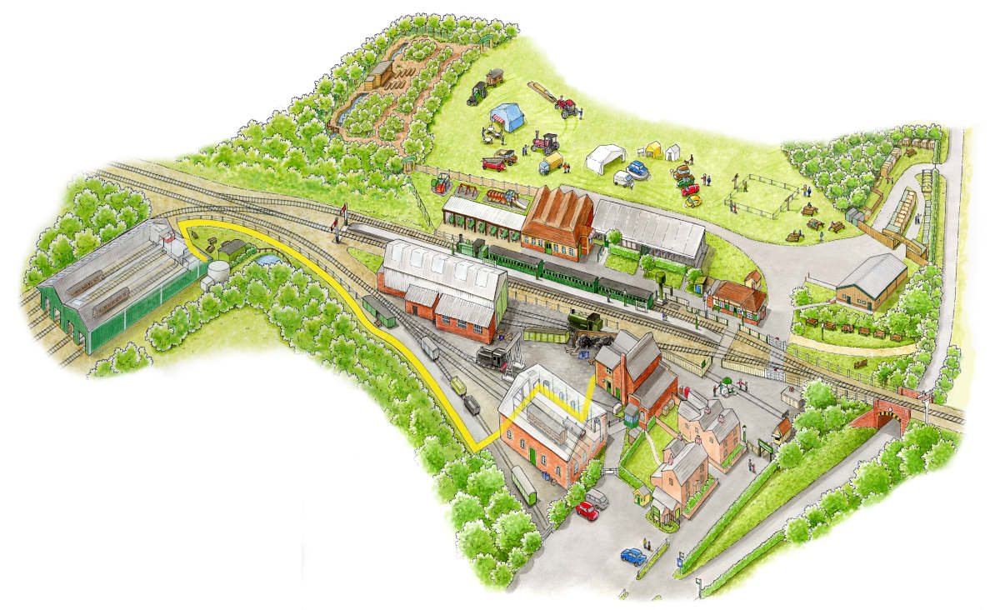

The *Somewhen Storytelling Festival, 2023*, will take place at [Isle of Wight Steam Railway](https://iwsteamrailway.co.uk/), Havenstreet ([Google Maps](https://goo.gl/maps/HjeXqXxHpTARqzUQ6)).

## Site Map

## Transport Links

- *There are no buses to the Havenstreet Steam Railway but we are exploring the possibility of arranging a community bus service.* 
- Trains: steam train service to Havenstreet from Wootton and Smallbrook Junction (connects with Island Line)
  - [Isle of Wight Stam Railway timetable](https://iwsteamrailway.co.uk/visit/train-timetables/)
  - [Island Line timetable](https://www.southwesternrailway.com/plan-my-journey/timetables) (from May 21st, 2023: [[PDF](https://www.southwesternrailway.com/plan-my-journey/-/media/c9c27b9654ba4777a49068faed88c6dd.ashx)])
- Taxis:
    - Haven Taxis, Havenstreet, 01983 885093

